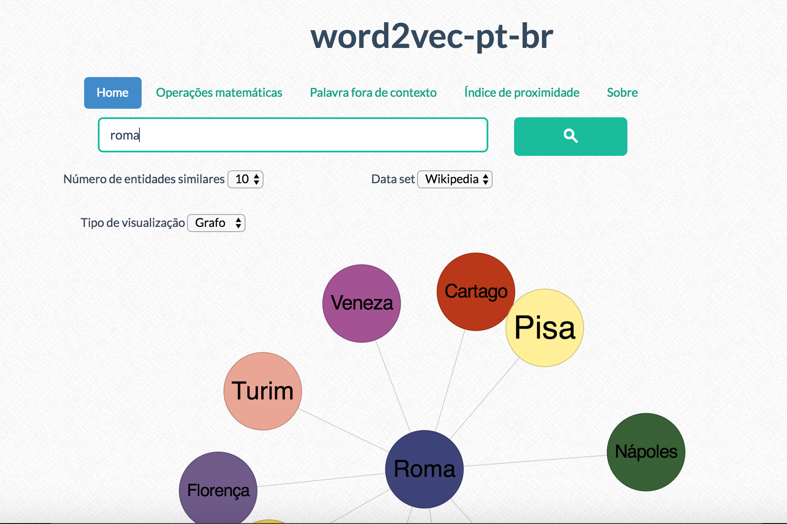
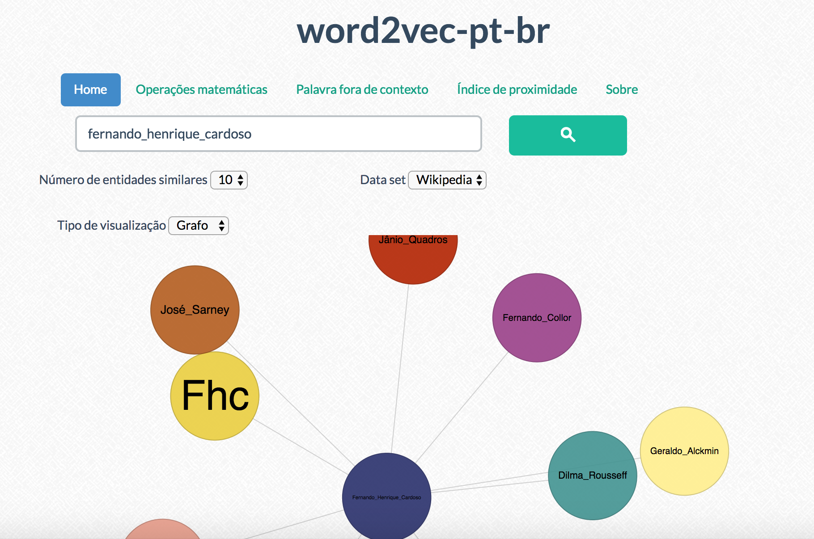
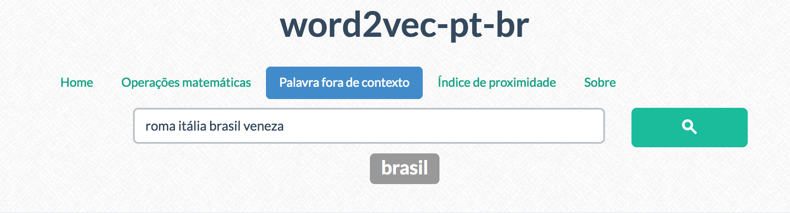

# word2vec-pt-br
Implementação e modelo gerado com o treinamento (trigram) da wikipedia em pt-br utilizando gensim.

O modelo treinado com a wiki-pt encontra-se disponível para download em: https://drive.google.com/file/d/0B_eXEo_eUPCDWnJ0YWtUdW1kVFk/view?usp=sharing

* Para demonstrar foi construído um exemplo usando um webserver em python (Flask) e uma visualização em grafos usando o D3.js.

## Rodando o exemplo de teste:

1. O modelo baixado acima, deve estar no mesmo diretório da pasta exemplo.

2. Crie uma virtualenv e instale as dependências de requirements.txt
```
    pip install -r requirements.txt
```
3. Inicie o servidor python
```
    python app.py
```

4. Acesse o servidor
```
    127.0.0.1:5000
```

### Observações: 
1. Como o modelo foi treinado com toda a base da wikipedia, é importante ter disponível pelo menos 2 GB livres de ram. Dependendo do espaço disponível, pode ser notada uma pequena lentidão no 'start' do servidor e na primeira 'consulta' por itens similares.

2. É possível alterar o app.py para usar outros métodos disponíveis na API do Gensim, detalhes em: https://radimrehurek.com/gensim/models/word2vec.html

### Screenshots:

* Exemplo de busca por palavras semanticamente similares.



* Exemplo utilizando um trigrama.



* Exemplo utilizando operações matemáticas nas palavras.


* Exemplo retornando a palavra mais distante dado um conjunto de palavras.


